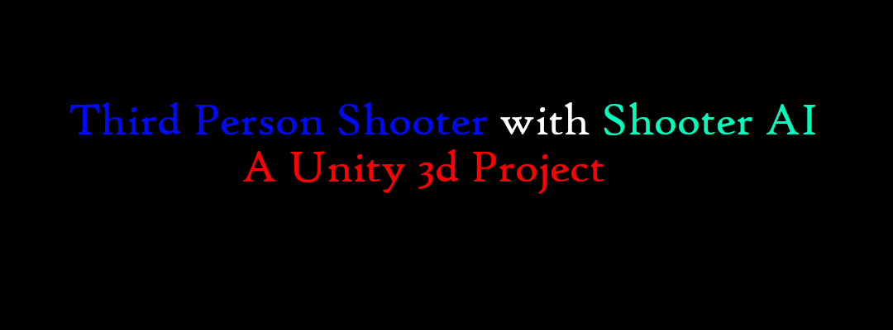
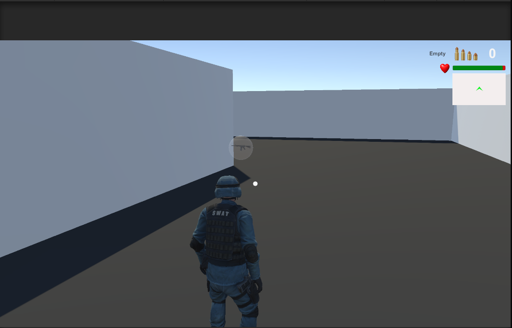
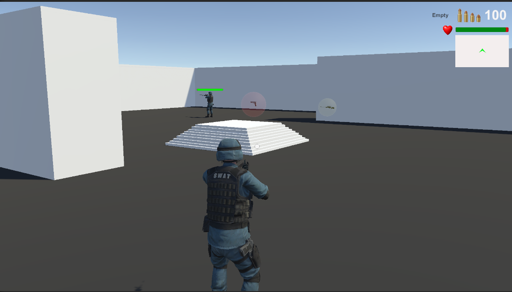
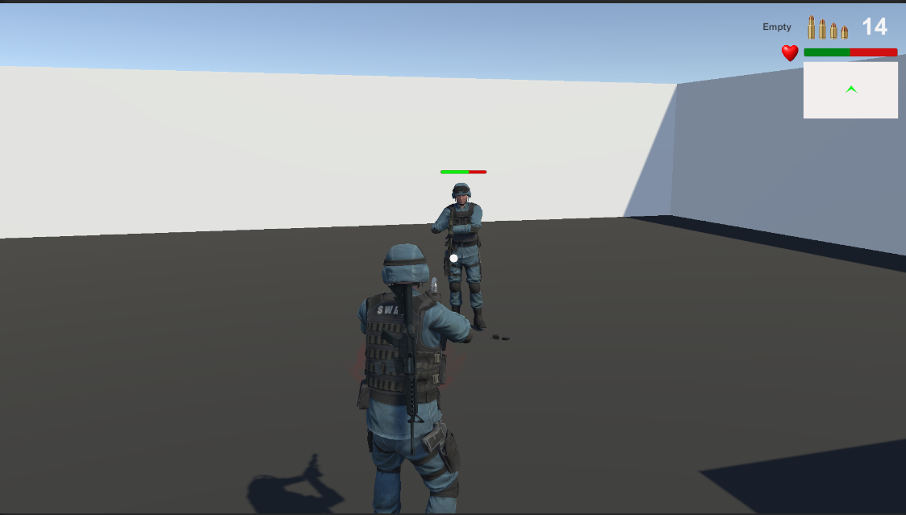

# Third Person Shooter Player With Shooter AI(NPC)
## Description : This unity packages have some dependency. You need to download and imported inside of this unity project's Asset folder.Where only one have external asset a mixamo character and animations.You are requested to download and put all the dependency in your project otherwise it may not work properly.See  Demo [1.0.0](https://www.youtube.com/watch?v=D0Iv-NGmIcg), [1.1.0](https://www.youtube.com/watch?v=nowBHY_60OA). 

## Contents :
- [x] Third Person Shooter Player(Locomotion with Jump,shoot,reload,weapon change)
- [x] First Person Shooter Player
- [x] Cross Platform Control
- [ ] Multiple AI
- [ ] AI take cover and Hide ability!
- [x] Mini Map
- [x] Shooter Navmesh AI with different state(Patrol,Find Weapon,Find Target,Death,Attack,ChaseTarget)
- [x] Three Raycast Weapon(Pistol,Rifle,Sniper)
- [x] Four Demo Scene
- [x] Weapon Pickup for player and AI
- [x] Demo Scene

See project [YT Demo](https://www.youtube.com/watch?v=D0Iv-NGmIcg) Video in  YouTube.

See Using project [Doc] Video in YouTube.
## Screenshots

## Dependent Packages :
---
* Unity Asset Store Packages
1. [Standard Asset Character](https://github.com/Unity-Technologies/Standard-Assets-Characters)
2. [AWP SNIPER](https://assetstore.unity.com/packages/3d/props/guns/awp-sniper-96523)
3. [Unity Particle Pack](https://assetstore.unity.com/packages/essentials/tutorial-projects/unity-particle-pack-127325#reviews)
4. [M9 Knife](https://assetstore.unity.com/packages/3d/props/weapons/m9-knife-7597#description)
5. [[PBR] Pistol](https://assetstore.unity.com/packages/3d/props/guns/pbr-pistol-33838)
6. [Rifle](https://assetstore.unity.com/packages/3d/props/guns/rifle-25668)
7. [FPS Grenade](https://assetstore.unity.Recordercom/packages/3d/fps-grenade-model-textures-63667#description)

---
* Unity Registry Store Assets
1. [Cinemachine](https://docs.unity3d.com/Packages/com.unity.cinemachine@2.3/manual/index.html)
2. [Animation Rigging](https://docs.unity3d.com/Packages/com.unity.animation.rigging@1.0/manual/index.html)

---
* External packages
* SWAT Character
1. [Mixamo](https://www/mixamo.com) 

---
* YT Video Tutorials
1. [Kiwi Coder](https://www.youtube.com/c/TheKiwiCoder)
2. [Brackeys](https://www.youtube.com/results?search_query=brackeys)

---
## Info
1. Project Name - Third Person Shooter Player
2. Used Unity Version to build this project - 2020.15f2
3. Developer Name : [baponkar](https://github.com/baponkar)
4. Social Site : 
5. Contact for Support : gamingjam60@gmail.com
6. Build Date : 07-07-2022
7. ~~Last  Updated : 09-10-2022~~

---
[LICENSE](LICENSE.md)

